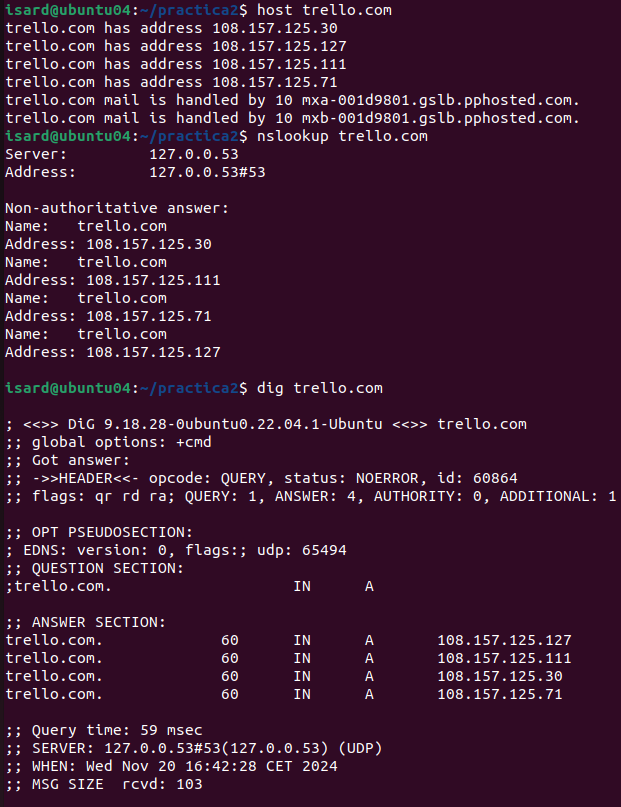
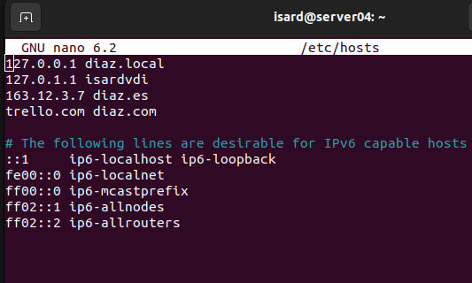
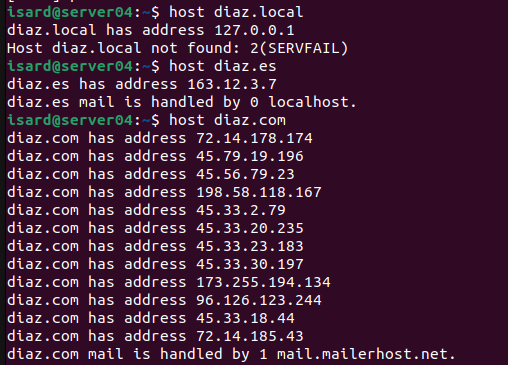
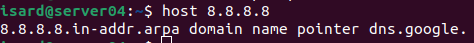
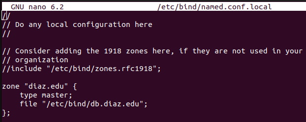
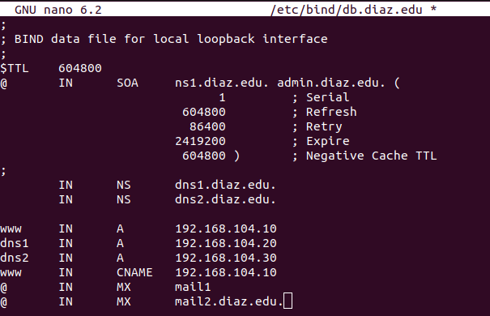
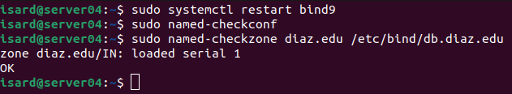
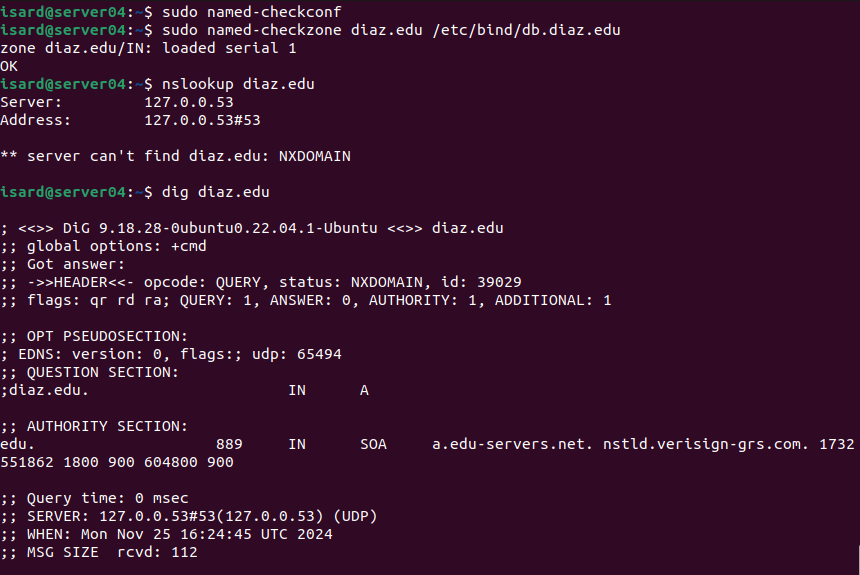

# Práctica 2. DNS

## Servicio de DNS

### Herramientas de diagnóstico

- Toma un dominio público de acuerdo a tu número de alumno:
  4. trello.com

- Intenta resolver las siguientes preguntas con las 3 herramientas presentadas: host,nslookup y dig.
  - Busca la IP asignada: 
  - Quien resuelve su DNS
  - Cuál es el servidor de correo electrónico. Si hay varios, determina cual es primero por su prioridad.
  - Haz la búsqueda de forma autorizada, es decir, que el servidor que contesta sea uno de los registos NS del dominio.

  

### Suplantar servicio DNS localmente.

- Edita el fichero `/etc/hosts` para que resuelva un nombre de dominio falso con el siguiente esquema: 
  - `miapellido.local` asociado a la dirección 127.0.0.1
  - `miapellido.es` asociado a una dirección pública inventada.
  - `miapellido.com` asociado a la dirección del dominio de la primera parte de la práctica. Si eres el nº 1 sería `github.com`

  
- Comprueba la resolución de los tres registros con alguna de las herramientas de diagnóstico.

- Comprueba la misma resolución pero haciendo que el servidor consultado sea el 8.8.8.8

### Configuración del servidor  DNS con BIND9

- Configura el dominio `miapellido.edu` en bind9. Debes hacerlo:
  - En el servidor linux
  - Conectándote al mismo mediante SSH
  - Utiliza las direcciones IP de tu red privada (192.168.1xx.0/24)
  - Deberás usar un fichero con un nombre similar a este: *db.miapellido.edu*

  
- Debes definir:
  - Número de versión 1
  - Un correo de administrador dentro del dominio.
  - Dos registros MX.
  - Dos registros NS con máquinas del propio dominio (por ejemplo *dns1* y *dns2*).
  - Varios registros A, al menos: *www, dns1, dns2*
  - Un registro CNAME asociado a la misma dirección que *www*

  
- Para comprobar que tu configuración es correcta debes:
  - Usar el comando de verificación sintáctica.
  - Reiniciar el servicio

  
  - Probar la resolución usando nslookup y dig. Ojo, la resolución de nombres debe correr a cargo del servidor Ubuntu.

  